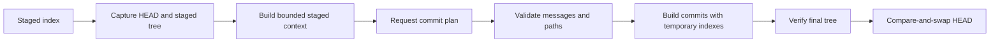

# git-autocommit

AI-assisted Git utility that turns staged changes into validated, atomic Conventional Commits. Generated commits are signed by default, but signing can be disabled explicitly.

## Why use it?

Most AI commit tools generate a message for one commit. `git-autocommit` instead plans a sequence of commits while keeping repository mutation deterministic:

- groups whole staged files into coherent commits;
- validates Conventional Commit messages;
- requires every staged path exactly once;
- rejects invented, omitted, or duplicated paths;
- verifies the final commit tree matches the captured staged tree;
- updates `HEAD` only if both `HEAD` and the index are unchanged.

The model proposes grouping and messages. Git and deterministic validation control what is committed.

## How it works



## Security and trust model

### Model authority

The configured model is asked only to propose commit messages and group repository-root-relative staged paths. It may return invalid output, but plans that invent, omit, or duplicate paths are rejected before any repository mutation. The model cannot modify file contents, execute Git, or update repository refs.

The returned plan must:

- be valid JSON;
- contain between one and `max_commits` entries;
- use supported Conventional Commit types;
- assign every staged path to exactly one commit.

### Repository mutation

`git-autocommit` captures `HEAD` and the staged tree before contacting the model. It constructs each proposed commit from that captured tree through temporary Git indexes, then verifies that the generated commit chain reproduces the captured staged tree exactly.

Before updating `HEAD`, it rechecks the live `HEAD` and index. The ref update uses Git's expected-old-value compare-and-swap behavior, so concurrent repository changes cause the operation to fail rather than overwrite newer state. Unstaged worktree content is never committed.

### Commit signing

Generated commits are signed by default using Git's configured signing mechanism. Disable signing only when required:

```sh
git-autocommit --no-sign
```

or:

```toml
sign_commits = false
```

Signing authenticates the configured Git identity. It does not prove that the model's grouping or messages are correct.

### Data sent to the model

The configured OpenAI-compatible endpoint receives:

- staged path names and status;
- staged diff statistics;
- staged per-file diffs, including Git's binary-diff representation when present;
- the commit-planning prompt.

Diff content is bounded by `max_diff_bytes`; later content may be truncated or omitted. A remote endpoint may therefore receive source code, credentials, or other sensitive staged content. Review the endpoint's transport, access, retention, and training policies before using it with private repositories.

### Hooks and policy enforcement

Normal commit hooks are intentionally not run because hooks can mutate content after analysis and invalidate the captured-tree guarantees. Run required formatting, linting, tests, secret scanning, DCO checks, or other policy gates before invoking `git-autocommit`, or enforce them in CI.

## Prerequisites

- Git available in `PATH`;
- Rust and Cargo for source installation;
- an OpenAI-compatible Chat Completions endpoint;
- a model that can reliably return strict JSON;
- working Git commit signing unless signing is disabled.

## Installation

From a repository checkout:

```sh
cargo install --path .
```

From GitHub:

```sh
cargo install --git https://github.com/ryjen/git-autocommit
```

## Quick start

```sh
git add src/ tests/
git-autocommit --dry-run
git-autocommit
git log --show-signature --oneline
```

`--dry-run` contacts the model and prints a fully validated plan, but does not create commits or move `HEAD`.

## Usage

```text
git-autocommit [OPTIONS]
```

| Option | Behavior |
|---|---|
| `--base-url <URL>` | Override the OpenAI-compatible API base URL. |
| `--model <MODEL>` | Override the model name. |
| `--timeout <SECONDS>` | Override the HTTP timeout. |
| `--prompt-dir <PATH>` | Load `system.md` and `plan.md` from another directory. |
| `--single` | Require exactly one commit containing every staged path. |
| `--no-single` | Disable single-commit mode configured in TOML or the environment. |
| `--sign` | Enable commit signing, overriding lower-precedence configuration. |
| `--no-sign` | Disable commit signing, overriding lower-precedence configuration. |
| `--dry-run` | Contact the model, validate the plan, and print it without creating commits. |
| `--show-prompt` | Render prompts from staged content and exit without contacting the model. |
| `--show-config` | Print resolved configuration and exit before reading staged changes. |

`--single` and `--no-single` are mutually exclusive. `--sign` and `--no-sign` are also mutually exclusive.

## Configuration

Create `.git/autocommit.toml` in the repository:

```toml
base_url = "http://127.0.0.1:8000/v1"
model = "dubnium-local"
timeout_seconds = 120
max_diff_bytes = 120000
max_commits = 8
single_commit = false
sign_commits = true
# prompt_dir = "/home/me/.local/share/git-autocommit"
```

Configuration precedence is:

```text
CLI > GIT_AUTOCOMMIT_* environment variables > .git/autocommit.toml > defaults
```

| Setting | CLI | Environment | TOML | Default |
|---|---|---|---|---|
| API base URL | `--base-url` | `GIT_AUTOCOMMIT_BASE_URL` | `base_url` | `http://127.0.0.1:8000/v1` |
| Model | `--model` | `GIT_AUTOCOMMIT_MODEL` | `model` | `dubnium-local` |
| Timeout | `--timeout` | `GIT_AUTOCOMMIT_TIMEOUT` | `timeout_seconds` | `120` seconds |
| Prompt directory | `--prompt-dir` | `GIT_AUTOCOMMIT_PROMPT_DIR` | `prompt_dir` | platform-local data directory |
| Maximum diff bytes | — | `GIT_AUTOCOMMIT_MAX_DIFF_BYTES` | `max_diff_bytes` | `120000` |
| Maximum commits | — | `GIT_AUTOCOMMIT_MAX_COMMITS` | `max_commits` | `8` |
| Single-commit mode | `--single` / `--no-single` | `GIT_AUTOCOMMIT_SINGLE_COMMIT` | `single_commit` | `false` |
| Sign commits | `--sign` / `--no-sign` | `GIT_AUTOCOMMIT_SIGN_COMMITS` | `sign_commits` | `true` |

The legacy `DUBNIUM_LOCAL_LLM_BASE_URL` and `DUBNIUM_LOCAL_LLM_MODEL` variables remain supported as fallback aliases.

Use `git-autocommit --show-config` to inspect the resolved values.

## Prompt customization

The binary includes built-in prompts. To override them, provide both files in the configured prompt directory:

```text
system.md
plan.md
```

The default directory is typically:

```text
~/.local/share/git-autocommit
```

The custom `plan.md` must contain all required tokens:

- `{{grouping_instruction}}`
- `{{max_commits}}`
- `{{files_json}}`
- `{{context}}`

If either override file is absent, the built-in prompt pair is used.

## Limitations

- Grouping is file-level: one file cannot be split across multiple generated commits.
- Only staged state is considered; unstaged changes are ignored.
- Rename detection is disabled, so renames appear to the model as deletion/addition changes.
- Large diffs are truncated according to `max_diff_bytes`.
- The endpoint must implement the expected OpenAI Chat Completions response shape.
- There is no interactive plan editor; use `--dry-run`, adjust the staged set or prompts, and rerun.
- Commit hooks do not run.
- Model quality still affects grouping and message quality; inspect the dry-run output before committing.

## Troubleshooting

| Error | Likely cause |
|---|---|
| `no staged changes` | The Git index is empty. Stage changes with `git add`. |
| `local AI unavailable` | The endpoint is unreachable or the request timed out. |
| `local AI returned an error` | The endpoint returned a non-success HTTP status. |
| `local AI did not return a JSON commit plan` | The model emitted malformed JSON or explanatory prose. |
| `commit plan ... paths` | The model omitted, invented, or duplicated staged paths. |
| `HEAD changed...` | Another process or user moved `HEAD` during planning. |
| `staged index changed...` | The index changed while the model request was in flight. |
| Git signing failure | Configure Git signing or rerun with `--no-sign`. |

## Development

```sh
cargo fmt --check
cargo clippy --all-targets --all-features -- -D warnings
cargo test --all-targets --all-features
cargo build --release
```

## License

Licensed under the Apache License 2.0. See [`LICENSE`](LICENSE).
