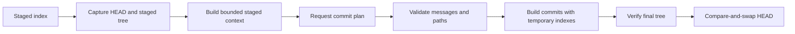

# git-autocommit

AI-assisted Git utility that turns staged changes into validated, atomic Conventional Commits. Generated commits are signed by default, but signing can be disabled explicitly.

## Why use it?

Most AI commit tools generate a message for one commit. `git-autocommit` instead plans a sequence of commits while keeping repository mutation deterministic:

- groups whole staged files into coherent commits;
- validates complete, bounded Conventional Commit messages;
- requires every staged path exactly once;
- rejects invented, omitted, or duplicated paths;
- verifies the final commit tree matches the captured staged tree;
- updates `HEAD` only if both `HEAD` and the index are unchanged.

The model proposes grouping and messages. Git and deterministic validation control what is committed.

## How it works


```mermaid
flowchart LR
    A[Staged index] --> B[Capture HEAD and staged tree]
    B --> C[Build bounded staged context]
    C --> D[Request commit plan]
    D --> E[Validate messages and paths]
    E --> F[Build commits with temporary indexes]
    F --> G[Verify final tree]
    G --> H[Compare-and-swap HEAD]
```

## Security and trust model

### Model authority

The configured model is asked only to propose commit messages and group repository-root-relative staged paths. It may return invalid output, but plans that invent, omit, or duplicate paths are rejected before any repository mutation. The model cannot modify file contents, execute Git, or update repository refs.

The returned plan must:

- be valid JSON;
- contain between one and `max_commits` entries;
- use a strictly parsed Conventional Commit subject of at most 72 characters;
- keep the complete message within 4096 bytes and free of control, bidirectional, or zero-width formatting characters;
- use only an optional prose body separated by one blank line, with no trailer-like metadata;
- assign every staged path to exactly one commit.

### Repository mutation

`git-autocommit` captures `HEAD` and the staged tree before contacting the model. It constructs each proposed commit from that captured tree through temporary Git indexes, then verifies that the generated commit chain reproduces the captured staged tree exactly.

Before updating `HEAD`, it acquires Git's worktree-specific index lock, then rechecks the live `HEAD` and staged tree while holding that lock. The lock remains held through Git's expected-old-value compare-and-swap ref update, so cooperating Git index writers cannot enter between validation and the `HEAD` move, while concurrent ref changes still cause the operation to fail. Unstaged worktree content is never committed.

### Commit signing

Generated commits are signed by default using Git's configured signing mechanism. Disable signing only when required:

```sh
git autocommit --no-sign
```

or:

```toml
sign_commits = false
```

Signing authenticates the configured Git identity. Before signing, `git-autocommit` validates the complete generated message, rejects trailer-like attribution or policy metadata, and bounds its size. Signing still does not prove that the model's grouping or prose are correct.

### Data sent to the model

The configured OpenAI-compatible endpoint receives:

- staged path names and status;
- staged diff statistics;
- staged per-file diffs, including Git's binary-diff representation when present;
- the commit-planning prompt.

Diff content is bounded by `max_diff_bytes`; later content may be truncated or omitted. After all placeholders are expanded, the combined system and plan prompt text is bounded by `max_prompt_bytes`, including path lists, statistics, headings, and custom prompt content. Oversized prompts are rejected before the endpoint is contacted. A remote endpoint may therefore receive source code, credentials, or other sensitive staged content. Review the endpoint's transport, access, retention, and training policies before using it with private repositories.

If the first model response fails deterministic plan validation, `git-autocommit` makes at most one repair request. That request contains the same rendered staged-change prompt plus a bounded JSON-encoded validation error, so the configured endpoint may receive the staged context twice for one invocation. The repaired response must pass the same message, path, commit-count, and single-commit validation before any repository mutation. To guarantee that the repair request stays within `max_prompt_bytes`, 1024 bytes of that limit are reserved for repair metadata; an initial system-plus-plan prompt that does not leave this headroom is rejected before the endpoint is contacted.

### Response handling

HTTPS is required for every non-loopback model endpoint. Plaintext HTTP is accepted only for the exact hostname `localhost` or a literal loopback IP address such as `127.0.0.1` or `::1`; private-network addresses and alternate hostnames are rejected before a connection is attempted.

`base_url` must contain only the endpoint origin and optional API path. Embedded credentials, query parameters, and fragments are rejected before connecting. The client appends `chat/completions` as URL path segments rather than through string concatenation.

Authenticated endpoints can use either `GIT_AUTOCOMMIT_BEARER_TOKEN` or `GIT_AUTOCOMMIT_BEARER_TOKEN_FILE`. The variables are mutually exclusive. The file form supports regular files and symlinked mounted secrets, accepts the token with no terminator, one LF, or one CRLF, and enforces a 16 KiB token limit; no other whitespace is trimmed. The credential is sent as a sensitive `Authorization: Bearer` header and rendered as `<redacted>` by `--show-config`, while the configured file path is omitted. Credentials are not accepted through CLI arguments, TOML, or URL user information, and both variables are removed from child Git and signing-process environments. Prefer the file form for mounted secrets and avoid placing direct tokens in shell history.

System and environment proxy settings are disabled for model requests. `HTTP_PROXY`, `HTTPS_PROXY`, `ALL_PROXY`, platform proxy configuration, and their lowercase variants are ignored so staged repository content is sent only to the host named by `base_url`.

HTTP redirects are disabled. Any 3xx response is rejected rather than forwarding staged repository content to another URL; configure `base_url` to the final endpoint directly.

The HTTP response body is capped at 256 KiB before JSON deserialization. A declared `Content-Length` above the limit is rejected before reading the body. Responses without a trustworthy length, including chunked responses, are streamed only through the limit plus one byte and rejected if oversized.

### Hooks and policy enforcement

Normal commit hooks are intentionally not run because hooks can mutate content after analysis and invalidate the captured-tree guarantees. Run required formatting, linting, tests, secret scanning, DCO checks, or other policy gates before invoking `git-autocommit`, or enforce them in CI.

## Prerequisites

- Git available in `PATH`;
- Rust and Cargo for source installation;
- an OpenAI-compatible Chat Completions endpoint;
- a model that can reliably return strict JSON;
- working Git commit signing unless signing is disabled.

## Installation

From a repository checkout:

```sh
cargo install --path .
```

From GitHub:

```sh
cargo install --git https://github.com/ryjen/git-autocommit
```

When `git-autocommit` is available in `PATH`, Git discovers it as a subcommand. The preferred invocation is therefore:

```sh
git autocommit <args>
```

Calling the executable directly as `git-autocommit <args>` is equivalent.

## Quick start

```sh
git add src/ tests/
git autocommit --dry-run
git autocommit
git log --show-signature --oneline
```

`--dry-run` contacts the model and prints a fully validated plan, but does not create commits or move `HEAD`.

## Usage

```text
git autocommit [OPTIONS]
```

| Option | Behavior |
|---|---|
| `--base-url <URL>` | Override the OpenAI-compatible API base URL. |
| `--model <MODEL>` | Override the model name. |
| `--timeout <SECONDS>` | Override the HTTP timeout. |
| `--prompt-dir <PATH>` | Load `system.md` and `plan.md` from another directory. |
| `--single` | Require exactly one commit containing every staged path. |
| `--no-single` | Disable single-commit mode configured in TOML or the environment. |
| `--sign` | Enable commit signing, overriding lower-precedence configuration. |
| `--no-sign` | Disable commit signing, overriding lower-precedence configuration. |
| `--dry-run` | Contact the model, validate the plan, and print it without creating commits. |
| `--show-prompt` | Render prompts from staged content and exit without contacting the model. |
| `--show-config` | Print resolved configuration and exit before reading staged changes. |

`--single` and `--no-single` are mutually exclusive. `--sign` and `--no-sign` are also mutually exclusive.

## Configuration

Create `.git/autocommit.toml` in the repository:

```toml
base_url = "http://127.0.0.1:8000/v1"
model = "dubnium-local"
timeout_seconds = 120
max_diff_bytes = 120000
max_prompt_bytes = 160000
max_commits = 8
single_commit = false
sign_commits = true
# prompt_dir = "/home/me/.local/share/git-autocommit"
```

Configuration precedence is:

```text
CLI > GIT_AUTOCOMMIT_* environment variables > .git/autocommit.toml > defaults
```

| Setting | CLI | Environment | TOML | Default |
|---|---|---|---|---|
| API base URL | `--base-url` | `GIT_AUTOCOMMIT_BASE_URL` | `base_url` | `http://127.0.0.1:8000/v1` |
| Model | `--model` | `GIT_AUTOCOMMIT_MODEL` | `model` | `dubnium-local` |
| Bearer token | — | `GIT_AUTOCOMMIT_BEARER_TOKEN` | — | unset |
| Bearer token file | — | `GIT_AUTOCOMMIT_BEARER_TOKEN_FILE` | — | unset |
| Timeout | `--timeout` | `GIT_AUTOCOMMIT_TIMEOUT` | `timeout_seconds` | `120` seconds |
| Prompt directory | `--prompt-dir` | `GIT_AUTOCOMMIT_PROMPT_DIR` | `prompt_dir` | platform-local data directory |
| Maximum diff bytes | — | `GIT_AUTOCOMMIT_MAX_DIFF_BYTES` | `max_diff_bytes` | `120000` |
| Maximum prompt bytes | — | `GIT_AUTOCOMMIT_MAX_PROMPT_BYTES` | `max_prompt_bytes` | `160000` |
| Maximum commits | — | `GIT_AUTOCOMMIT_MAX_COMMITS` | `max_commits` | `8` |
| Single-commit mode | `--single` / `--no-single` | `GIT_AUTOCOMMIT_SINGLE_COMMIT` | `single_commit` | `false` |
| Sign commits | `--sign` / `--no-sign` | `GIT_AUTOCOMMIT_SIGN_COMMITS` | `sign_commits` | `true` |

The legacy `DUBNIUM_LOCAL_LLM_BASE_URL` and `DUBNIUM_LOCAL_LLM_MODEL` variables remain supported as fallback aliases.

Use `git autocommit --show-config` to inspect the resolved values. A configured bearer credential appears only as `<redacted>`; token-file paths are not printed.

For an authenticated endpoint, provide either the token directly:

```sh
GIT_AUTOCOMMIT_BEARER_TOKEN="$(cat /secure/path/token)" git autocommit --dry-run
```

or point to a mounted credential file:

```sh
GIT_AUTOCOMMIT_BEARER_TOKEN_FILE=/run/secrets/model-token git autocommit --dry-run
```

Do not set both variables. Token files must resolve to regular files, may end in one LF or CRLF, and may contain at most 16 KiB before that optional terminator. Additional or embedded whitespace is rejected.

## Prompt customization

The binary includes built-in prompts. To override them, provide both files in the configured prompt directory:

```text
system.md
plan.md
```

The default directory is typically:

```text
~/.local/share/git-autocommit
```

The custom `plan.md` must contain all required tokens:

- `{{grouping_instruction}}`
- `{{max_commits}}`
- `{{files_json}}`
- `{{context}}`

If either override file is absent, the built-in prompt pair is used. Custom prompts can request narrower messages, but generated output must still pass the built-in message policy.

## Limitations

- Grouping is file-level: one file cannot be split across multiple generated commits.
- Only staged state is considered; unstaged changes are ignored.
- Rename detection is disabled, so renames appear to the model as deletion/addition changes.
- Large diffs are truncated according to `max_diff_bytes`.
- The complete expanded prompt must fit within `max_prompt_bytes`, with 1024 bytes reserved for bounded repair metadata; repositories with unusually many or long paths may require a larger ceiling or a smaller staged set.
- The endpoint must implement the expected OpenAI Chat Completions response shape.
- There is no interactive plan editor; use `--dry-run`, adjust the staged set or prompts, and rerun.
- Commit hooks do not run.
- Model quality still affects grouping and message quality; inspect the dry-run output before committing.

## Troubleshooting

| Error | Likely cause |
|---|---|
| `no staged changes` | The Git index is empty. Stage changes with `git add`. |
| `local AI unavailable` | The endpoint is unreachable or the request timed out. |
| `local AI returned an error` | The endpoint returned a non-success HTTP status. |
| `plaintext HTTP model endpoints are allowed only on loopback...` | A non-loopback `base_url` uses HTTP; configure HTTPS or use an exact loopback endpoint for local development. |
| `local AI base_url must not include...` | `base_url` contains embedded credentials, a query string, or a fragment; configure only the endpoint origin/path and use one bearer-token environment variable when authentication is required. |
| `GIT_AUTOCOMMIT_BEARER_TOKEN and GIT_AUTOCOMMIT_BEARER_TOKEN_FILE cannot...` | Both credential sources are configured; unset one of them. |
| `GIT_AUTOCOMMIT_BEARER_TOKEN must...` | The direct token is empty, exceeds 16 KiB, contains whitespace or non-ASCII characters, is not UTF-8, or cannot form a valid HTTP header value. |
| `unable to read GIT_AUTOCOMMIT_BEARER_TOKEN_FILE` | The configured credential file is missing or unreadable. |
| `GIT_AUTOCOMMIT_BEARER_TOKEN_FILE must...` | The file path is empty, does not resolve to a regular file, or its content is empty, exceeds 16 KiB, is invalid UTF-8, contains unsupported whitespace or non-ASCII characters, or cannot form a valid HTTP header value. |
| `local AI endpoint returned HTTP redirect...` | `base_url` points to a redirecting URL; configure the final endpoint directly. |
| `rendered prompt is ... exceeding the ...-byte limit` | Expanded prompt text, including metadata and custom prompts, exceeds `max_prompt_bytes`. |
| `rendered prompt is ... leaving fewer than the ...-byte repair reserve` | The initial prompt fits the hard limit but leaves insufficient headroom for the bounded repair request; reduce staged context or increase `max_prompt_bytes`. |
| `local AI response exceeds the ...-byte limit` | The endpoint returned more than the fixed 256 KiB safety ceiling. |
| `local AI did not return a JSON commit plan` | The first response was invalid JSON and the repair request also failed validation or could not be completed. |
| `commit plan entry ... invalid Conventional Commit message` | A response violated the deterministic message policy; the error now identifies the rejected rule. |
| `commit plan ... paths` | A response omitted, invented, or duplicated staged paths. |
| `local AI repair request failed after invalid commit plan` | The first plan was invalid and the single repair request could not be completed. |
| `local AI returned an invalid commit plan after one repair attempt` | Both the original response and the single repaired response failed deterministic plan validation. |
| `HEAD changed...` | Another process or user moved `HEAD` during planning. |
| `staged index changed...` | The index changed while the model request was in flight. |
| `unable to lock staged index...` | Another Git process holds or is creating the index lock; let it finish and retry. |
| Git signing failure | Configure Git signing or rerun with `--no-sign`. |

## Development

```sh
cargo fmt --check
cargo clippy --all-targets --all-features -- -D warnings
cargo test --all-targets --all-features
cargo build --release
```

## License

Licensed under the Apache License 2.0. See [`LICENSE`](LICENSE).
